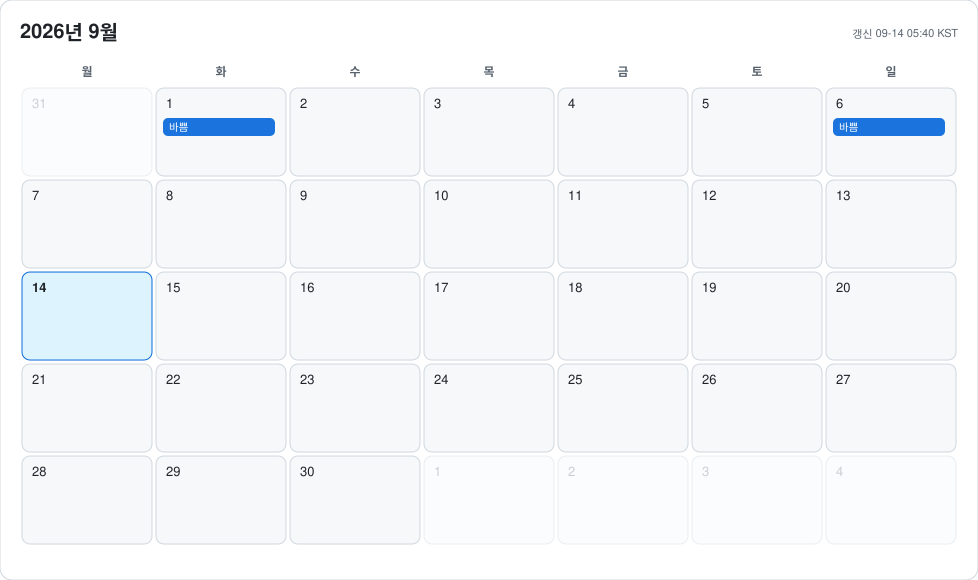

<!-- 아래 블록이 실제 달력입니다. 라이트/다크 테마에 맞춰 자동으로 바뀝니다. -->
<picture>
  <source media="(prefers-color-scheme: dark)" srcset="assets/calendar-dark.svg">
  
</picture>

# calendar-readme

Google 캘린더의 비공개 iCal 피드를 읽어 **README에 그대로 박히는 월간 달력 SVG**를 만듭니다.
GitHub Actions가 주기적으로 다시 그려서 커밋하므로, 저장소를 열면 항상 최신 상태입니다.

- OAuth·GCP 프로젝트 불필요 — 캘린더의 비공개 iCal 주소만 있으면 됩니다
- 라이트/다크 테마 각각 렌더
- 일정 제목을 공개할지 `바쁨`으로 가릴지 **일정 단위로 제어**

> 이 프로젝트는 Google과 무관한 비공식 도구입니다.

## 설정

### 1. 비공개 iCal 주소 얻기

Google 캘린더 → 좌측에서 캘린더 선택 → **설정 및 공유** → *캘린더 통합* →
**비공개 주소(iCal 형식)** 를 복사합니다. `.ics`로 끝나는 URL입니다.

> **이 주소는 사실상 비밀번호입니다.** 아는 사람은 누구나 당신의 전체 일정을 읽을 수 있습니다.
> 저장소나 `config.toml`에 절대 넣지 마세요. 유출되면 같은 화면에서 *주소 재설정*을 누르면 됩니다.

### 2. 저장소에 등록

**Settings → Secrets and variables → Actions → New repository secret**

| Name | Value |
| --- | --- |
| `ICS_URL_PERSONAL` | 위에서 복사한 `.ics` 주소 |

### 3. 설정 파일

```bash
cp config.example.toml config.toml
```

`config.toml`에서 시간대, 로케일, 공개 범위를 조정합니다. 주요 항목:

```toml
[[calendars]]
name = "personal"
url_env = "ICS_URL_PERSONAL"   # 여기엔 '환경변수 이름'만 적습니다
visibility = "tag"             # title | busy | tag

[filter]
public_tag = "[public]"
```

### 4. 공개 범위 (`visibility`)

| 값 | 동작 |
| --- | --- |
| `title` | 모든 일정 제목을 그대로 노출 |
| `busy` | 제목을 감추고 `바쁨`으로만 표시 |
| `tag` | 제목이 `public_tag`로 시작하는 일정만 제목 노출, 나머지는 `바쁨` |

`tag` 모드에서 특정 일정을 공개하려면 캘린더에서 제목을 `[public] 알고리즘 스터디`로 저장하세요.
README에는 `알고리즘 스터디`로 표시됩니다.

**공개 저장소라면 렌더 결과는 전 세계에 공개됩니다.** 비공개 `.ics`를 쓰더라도 그렸다는 사실
자체가 공개이므로, 기본값인 `tag`를 그대로 두는 편을 권장합니다.

### 5. 다른 저장소의 README에 넣기

이 저장소를 공개로 두고, 프로필 README 등에서 raw URL로 참조합니다:

```markdown
<picture>
  <source media="(prefers-color-scheme: dark)"
          srcset="https://raw.githubusercontent.com/<user>/<repo>/main/assets/calendar-dark.svg">
  /<repo>/main/assets/calendar-light.svg">
</picture>
```

## 로컬 실행

```bash
pip install -r requirements.txt

python scripts/generate.py --demo          # 더미 데이터로 렌더 확인
set ICS_URL_PERSONAL=https://...ics        # Windows CMD
python scripts/generate.py
python scripts/generate.py --month 2026-10
```

결과는 `assets/calendar-light.svg`, `assets/calendar-dark.svg`에 저장됩니다.

## 알아둘 점

- **갱신 지연**: GitHub은 README 이미지를 camo 프록시로 캐싱합니다. 커밋 직후에도 몇 분간
  이전 이미지가 보일 수 있습니다.
- **cron 지연**: GitHub Actions의 예약 실행은 정시를 보장하지 않고 수십 분 밀릴 수 있습니다.
- **워크플로 자동 비활성화**: 공개 저장소는 60일간 활동이 없으면 예약 워크플로가 꺼집니다.
  이 저장소는 자기 자신에게 커밋하므로 해당되지 않습니다.
- **반복 일정**: `RRULE`은 `recurring-ical-events`로 펼칩니다. `icalendar` 단독으로는 안 됩니다.

## 라이선스

MIT
